# OMS 订单管理系统 - 技术白皮书

> **文档版本**: v1.0  
> **创建日期**: 2026-02-21  
> **文档类型**: 技术白皮书  
> **适用范围**: 技术决策、架构评审、开发实施、运维部署

---

## 文档说明

本白皮书整合 OMS 系统的**当前代码实现**、**技术规范**、**需求文档**与**用户手册**，形成完整的技术说明基线，供架构师、开发者、运维及合作伙伴参考。

---

## 1. 系统概述

### 1.1 产品定位

OMS（Order Management System）是一套基于 **Next.js** 与 **飞书多维表格** 的订单/物流/财务管理系统，面向中小团队提供轻量级业务管理能力，以飞书多维表格为主数据源，无需自建数据库。

### 1.2 核心特性

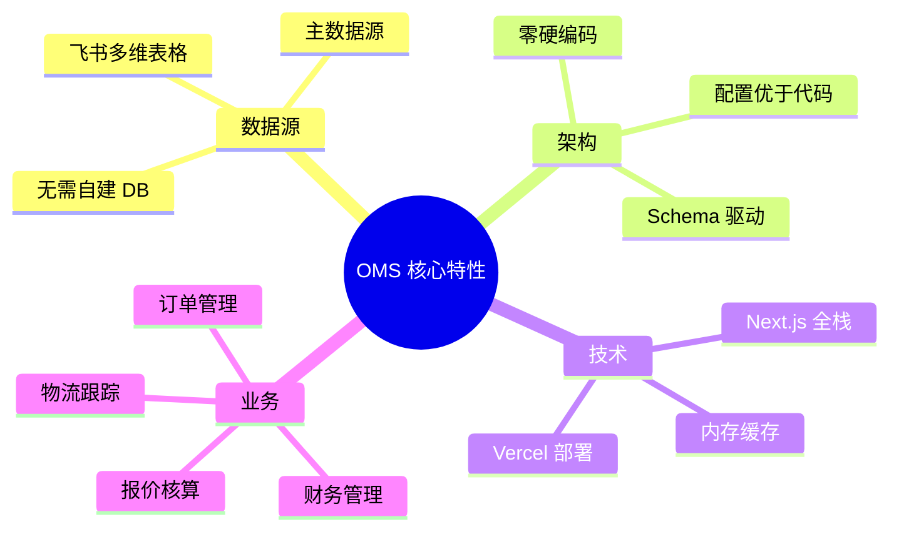

### 1.3 系统边界

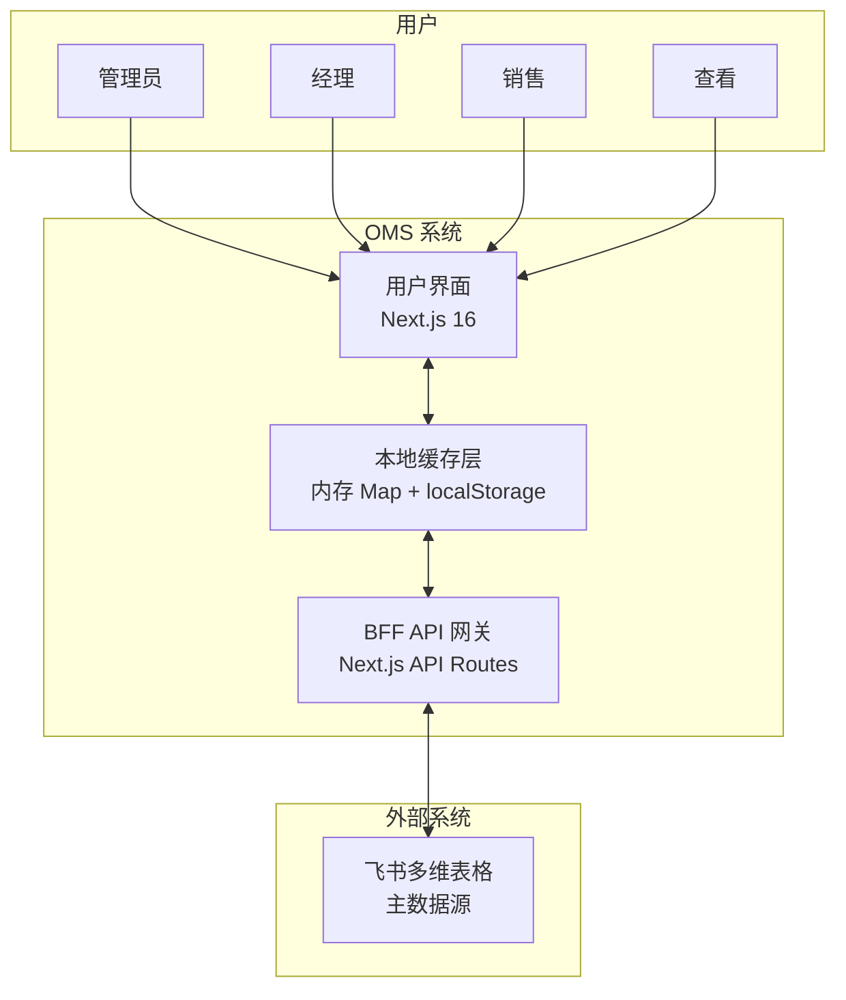

---

## 2. 技术架构

### 2.1 整体架构

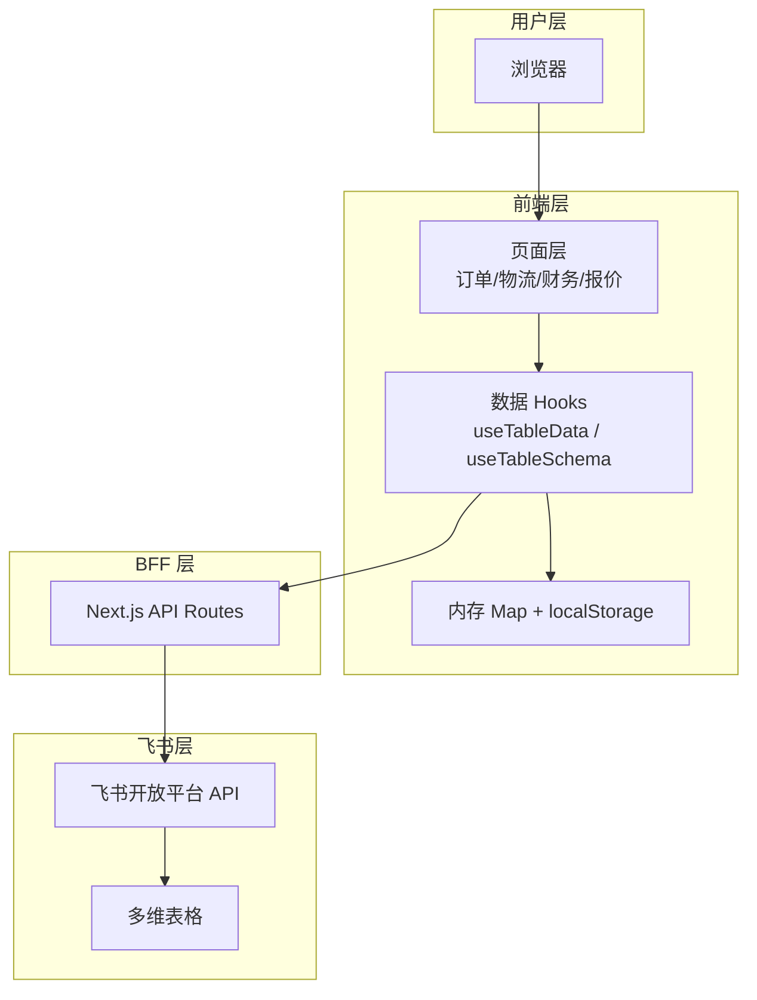

### 2.2 数据流架构（强制遵守）

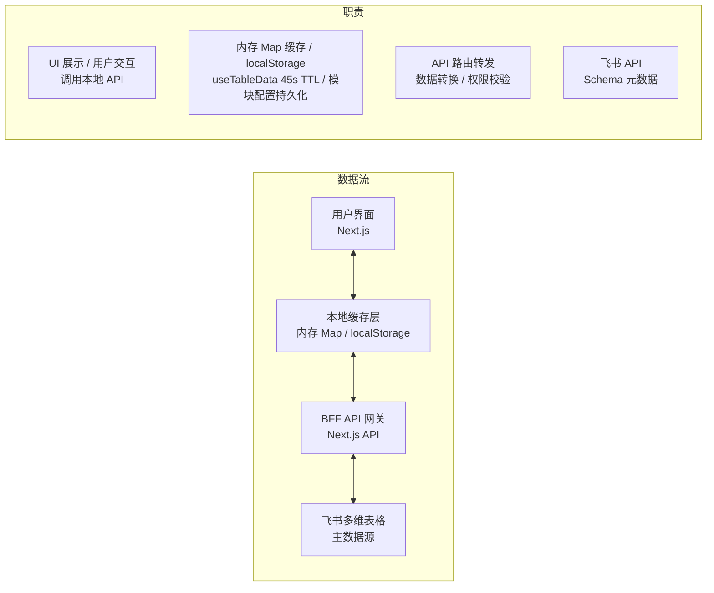

**核心约束**：
- 前端页面**禁止**直接调用飞书 API
- 必须通过 Next.js API Routes 作为网关代理

### 2.3 统一数据层架构

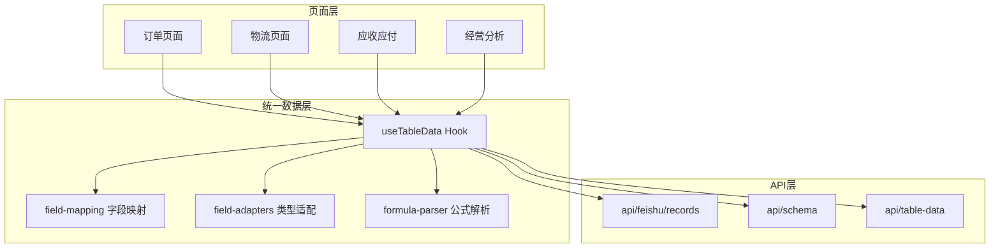

---

## 3. 技术栈

### 3.1 核心技术栈

| 层级 | 技术选型 | 版本 | 说明 |
|------|----------|------|------|
| 框架 | Next.js | 16.1.6 | App Router、SSR、API Routes |
| UI | React | 19.2.3 | 服务端/客户端组件 |
| 组件库 | Ant Design | 6.3.0 | 表格、表单、布局 |
| 图表 | @ant-design/charts | 2.6.7 | 经营分析可视化 |
| 数据缓存 | 内存 Map | - | useTableData 内 clientCache，TTL 45s |
| 状态管理 | Zustand | 5.0.11 | 认证、全局状态 |
| 持久化 | localStorage | - | 认证（Zustand persist）、模块配置、表格配置 |
| 校验 | Zod | 4.3.6 | 环境变量、Schema 校验 |
| 部署 | Vercel | - | SSR 部署 |

**缓存实现说明**（以代码为准）：
- **useTableData**：内存 `Map`（clientCache），TTL 45s，刷新即清空
- **useModuleConfig**：内存 + localStorage 持久化
- **useTableConfig**：localStorage 持久化
- **auth/store**：Zustand `persist` 使用 localStorage
- **lib/cache/indexeddb.ts**：存在 localforage 封装，但**未被任何模块引用**，属预留能力

### 3.2 项目结构

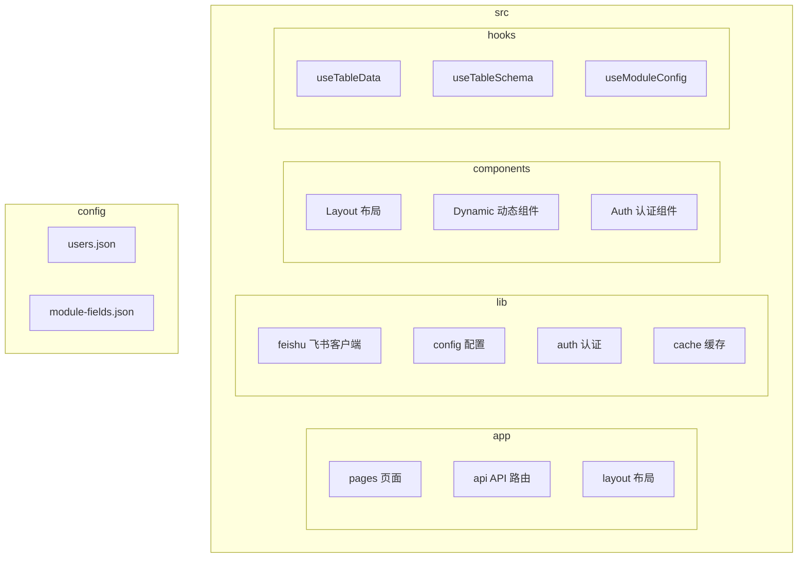

### 3.3 目录结构

```
omsv2/
├── src/
│   ├── app/                    # Next.js App Router
│   │   ├── api/                # BFF API 路由
│   │   │   ├── auth/           # 登录、改密
│   │   │   ├── feishu/         # 飞书 records/schema/sync
│   │   │   ├── config/         # 表 ID、模块配置
│   │   │   ├── orders/         # 订单 CRUD
│   │   │   └── table-data/     # 统一数据接口
│   │   ├── hooks/              # 数据 Hooks
│   │   ├── components/         # 布局、动态组件
│   │   ├── orders/             # 订单管理页
│   │   ├── logistics/          # 物流跟踪页
│   │   ├── finance/            # 财务管理页
│   │   ├── system/             # 系统管理页
│   │   └── ...
│   └── lib/
│       ├── feishu/             # 飞书客户端、字段映射、适配器
│       ├── config/             # 环境、路由、消息
│       ├── auth/                # 认证、权限
│       └── cache/               # IndexedDB 封装（未使用）、离线指示器
├── config/                     # JSON 配置与缓存
│   ├── users.json              # 用户配置
│   ├── module-fields.json      # 模块字段权限
│   ├── access-logs.json        # 访问日志（运行时生成）
│   └── .schema-cache/          # Schema 文件缓存（同步时生成，Vercel 用 /tmp）
└── docs/                       # 文档
```

---

## 4. 核心实现

### 4.1 统一数据层：useTableData

**职责**：整合 Schema 获取、字段映射、类型适配、格式化输出，为页面提供统一数据结构。

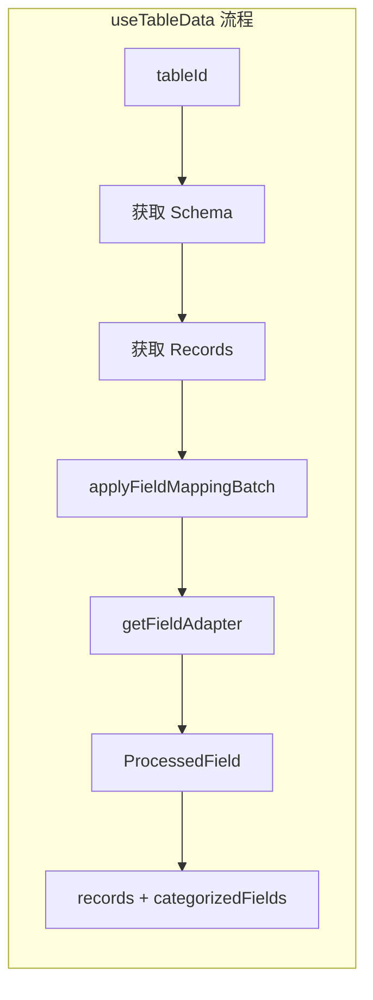

**输出**：
- `records`：处理后的记录数组，`fields` 以 dataKey 为键
- `schema`：表结构元数据
- `mappedFields`：映射后的字段列表
- `categorizedFields`：按 basic/logistics/financial/product 分组
- `stats`：统计信息

**客户端缓存**：内存 Map `clientCache`，tableId → { schema, records, ts }，TTL 45s。刷新页面后清空，离线时可查看当前会话内已加载的数据。

### 4.2 字段映射系统：field-mapping

**职责**：根据字段名、类型、UI 类型匹配规则，生成 dataKey、category、format、priority。

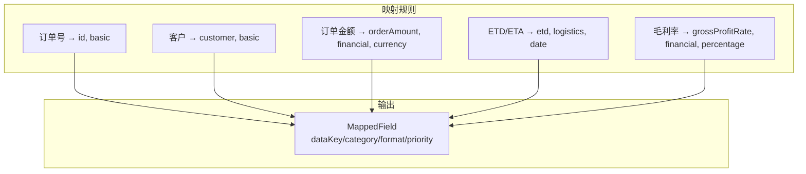

**dataKey 生成规则**：驼峰命名，如 `订单金额CNY` → `orderAmountCNY`。

### 4.3 字段类型适配器：field-adapters

**职责**：将飞书原始值解析、格式化、比较，支持 20+ 种飞书字段类型。

| 飞书类型 | type | Adapter | 说明 |
|---------|------|---------|------|
| 文本 | 1 | textAdapter | 直接显示 |
| 数字 | 2 | numberAdapter | currency/percentage |
| 单选 | 3 | singleSelectAdapter | 选项文本 |
| 日期 | 5 | dateAdapter | YYYY-MM-DD |
| 公式 | 20/21 | 智能推断 | 根据值类型格式化 |
| 创建时间 | 1001 | dateAdapter | 日期时间 |
| 富文本 | 3001 | textAdapter | 文本显示 |
| 未知 | - | textAdapter | Fallback |

### 4.4 公式解析：formula-parser

**职责**：处理飞书公式字段的两种返回形式。

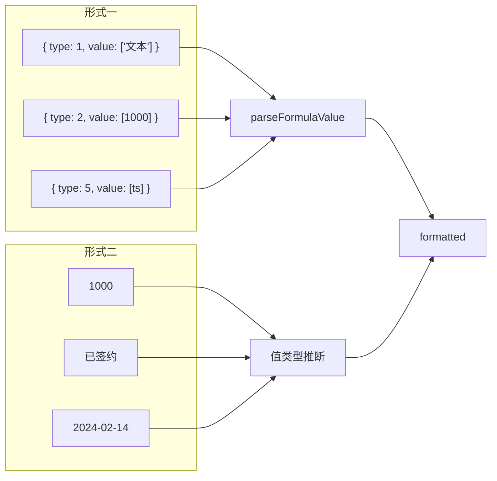

### 4.5 飞书客户端：client.ts

**职责**：封装飞书开放平台 API，仅服务端使用。

- `getAppToken()`：获取 app_access_token，带缓存
- `getRecords(tableId, options)`：分页获取记录
- `createRecord(tableId, fields)`：创建记录
- `updateRecord(tableId, recordId, fields)`：更新记录
- `deleteRecord(tableId, recordId)`：删除记录
- `getTableSchema(tableId)`：获取表结构

---

## 5. API 设计

### 5.1 API 路由总览

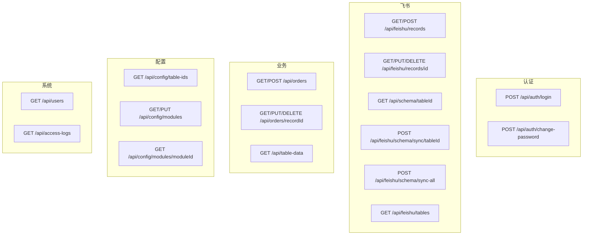

### 5.2 核心 API 说明

| 接口 | 方法 | 说明 |
|------|------|------|
| /api/feishu/records | GET | 获取表记录，支持 tableId、pageSize、pageToken、filter |
| /api/feishu/records | POST | 创建记录 |
| /api/feishu/records/[id] | GET/PUT/DELETE | 单条记录 CRUD |
| /api/schema/[tableId] | GET | 获取表 Schema（含缓存） |
| /api/feishu/schema/sync/[tableId] | POST | 同步单表 Schema |
| /api/feishu/schema/sync-all | POST | 同步全部表 Schema |
| /api/table-data | GET | 统一数据接口，返回 records + schema + mappedFields |
| /api/orders | GET/POST | 订单列表/创建 |
| /api/orders/[recordId] | GET/PUT/DELETE | 订单详情/更新/删除 |

---

## 6. 数据模型

### 6.1 飞书多维表格结构

#### 订单表 (orders)

| 字段名 | 类型 | 说明 |
|--------|------|------|
| 订单号 | 单行文本 | 唯一标识 |
| RITOS | 单行文本 | 业务编号 |
| 客户 | 单行文本 | 客户名称 |
| 产品 | 单行文本 | 产品名称 |
| 详细规格 | 单行文本 | 产品规格 |
| 数量 | 数字 | 订单数量 |
| 单价 | 数字 | 产品单价 |
| 订单金额 | 数字/公式 | 订单金额 |
| 货币 | 单选 | CNY/USD |
| 商务进度 | 单选 | 待处理/处理中/已完成 |
| 物流进度 | 单选 | 物流状态 |
| 签约日 | 日期 | 签约日期 |
| ETD/ETA | 日期 | 物流日期 |
| 毛利率 | 公式 | 计算字段 |
| 退税额 | 公式 | 计算字段 |

#### 客户表 / 产品表

参见 [飞书配置](feishu-setup.md)。

### 6.2 字段分类标准

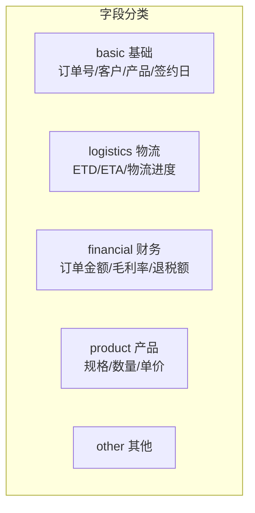

### 6.3 模块与表映射

| 模块 | 路由 | 表 ID 环境变量 |
|------|------|----------------|
| 订单管理 | /orders | FEISHU_TABLE_ORDERS |
| 物流跟踪 | /logistics | FEISHU_TABLE_ORDERS |
| 应收应付 | /finance/receivable-payable | FEISHU_TABLE_ORDERS |
| 银行流水 | /finance/cash-flow | FEISHU_TABLE_CASH_FLOW |
| 经营分析 | /finance/business-analysis | FEISHU_TABLE_FINANCE |
| 客户/产品/供应商 | iframe | *_URL 嵌入链接 |

### 6.4 数据与元数据持久化

> 以下以代码实现为准。

#### 6.4.1 业务数据

**不落在 OMS 本地**，主数据源为飞书多维表格。

| 操作 | 实现 |
|------|------|
| 读 | `feishuClient.getRecords()` → 飞书 API |
| 写 | `feishuClient.createRecord()` / `updateRecord()` / `deleteRecord()` → 飞书 API |

#### 6.4.2 Schema 元数据（表结构）

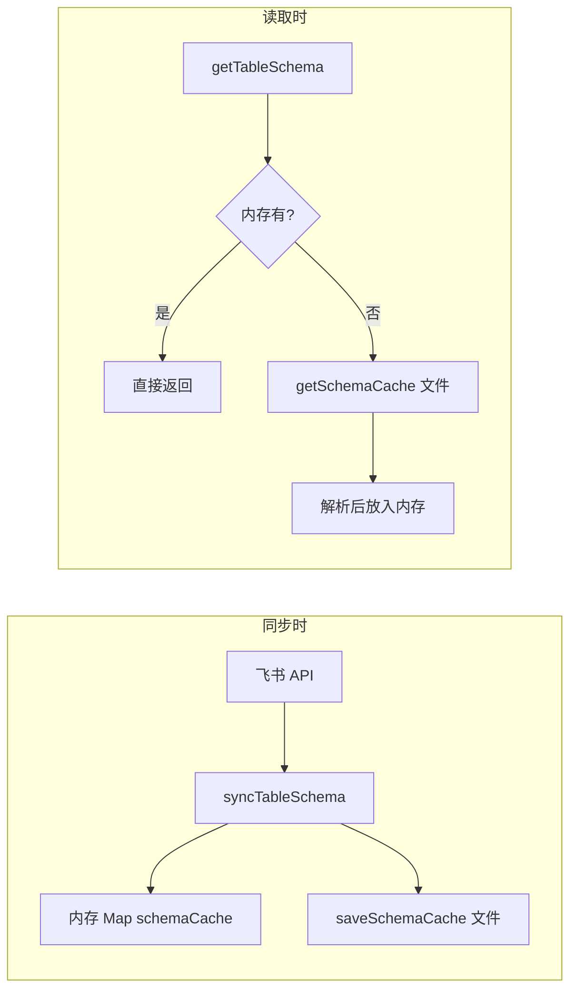

| 层级 | 位置 | 实现 |
|------|------|------|
| 内存 | `schema.ts` 中 `schemaCache: Map` | 进程内缓存 |
| 文件 | `config/.schema-cache/{tableId}.json`（本地）或 `/tmp/schema-cache`（Vercel） | `schema-cache.ts` 中 `fs.writeFile` / `fs.readFile` |

#### 6.4.3 持久化汇总

| 类型 | 存储位置 | 读写方式 |
|------|----------|----------|
| 业务数据 | 飞书多维表格 | 飞书 API |
| Schema | 内存 + `config/.schema-cache/*.json` 或 `/tmp/schema-cache` | `schema-cache.ts` |
| 模块配置 | `config/module-fields.json` | `module-fields.ts` + fs |
| 用户 | `config/users.json` | API route + fs |
| 访问日志 | `config/access-logs.json` | `access-log.ts` + fs |
| 表格列配置 | 浏览器 localStorage | `useTableConfig`，键 `oms_table_configs` |
| 模块配置缓存 | 浏览器 localStorage | `useModuleConfig`，键 `oms_module_config_${moduleId}` |
| 登录状态 | 浏览器 localStorage | Zustand persist |

**localStorage 说明**：指浏览器 Web Storage API，非项目内 config 文件。用于用户偏好（列配置）、API 响应 fallback、登录状态持久化。

---

## 7. 认证与权限

### 7.1 角色定义

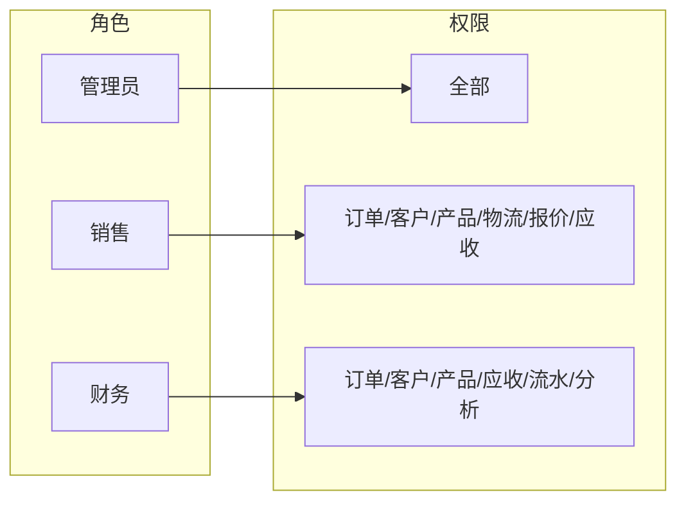

| 角色 | 订单 | 客户 | 产品 | 物流 | 报价 | 应收 | 流水 | 分析 |
|------|------|------|------|------|------|------|------|------|
| 管理员 | 全部 | 全部 | 全部 | 全部 | 全部 | 全部 | 全部 | 全部 |
| 销售 | CRUD | CRUD | CRUD | CRUD | CRUD | 读/改 | - | - |
| 财务 | 读 | 读 | 读 | - | - | CRUD | CRUD | 读 |

### 7.2 实现方式

- **认证**：`config/users.json` 配置用户，Zustand 持久化到 localStorage
- **权限**：`useAuthStore` 的 `hasPermission`、`canAccessModule`
- **守卫**：`AuthGuard`、`PermissionGuard` 组件

---

## 8. 功能模块

### 8.1 模块总览

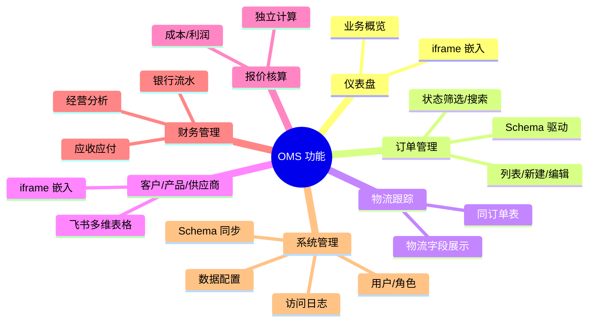

### 8.2 页面与实现方式

| 页面 | 路径 | 实现方式 |
|------|------|----------|
| 仪表盘 | /dashboard | iframe 嵌入飞书仪表盘 |
| 订单管理 | /orders | useTableData + DynamicTable |
| 物流跟踪 | /logistics | useTableData，物流字段分类 |
| 应收应付 | /finance/receivable-payable | useTableData，财务字段 |
| 银行流水 | /finance/cash-flow | iframe 或独立表 |
| 经营分析 | /finance/business-analysis | @ant-design/charts |
| 客户/产品/供应商 | /customers 等 | FeishuIframe 嵌入 |
| 报价核算 | /quotation | 本地表单计算 |
| 系统管理 | /system/* | 用户、同步、配置、日志 |

---

## 9. 配置与部署

### 9.1 环境变量

| 变量名 | 描述 | 必需 |
|--------|------|------|
| FEISHU_APP_ID | 飞书应用 ID | 是 |
| FEISHU_APP_SECRET | 飞书应用密钥 | 是 |
| FEISHU_BASE_APP_TOKEN | 飞书应用 Token | 是 |
| FEISHU_TABLE_ORDERS | 订单表 ID | 是 |
| FEISHU_TABLE_CUSTOMERS | 客户表 ID | 否 |
| FEISHU_TABLE_PRODUCTS | 产品表 ID | 否 |
| FEISHU_TABLE_SUPPLIERS | 供应商表 ID | 否 |
| FEISHU_TABLE_CASH_FLOW | 现金流水表 ID | 否 |
| FEISHU_TABLE_FINANCE | 财务分析表 ID | 否 |
| NEXT_PUBLIC_FEISHU_TABLE_* | 客户端表 ID | 按需 |
| NEXT_PUBLIC_FEISHU_*_URL | iframe 嵌入 URL | 按需 |

### 9.2 部署方案：Vercel SSR

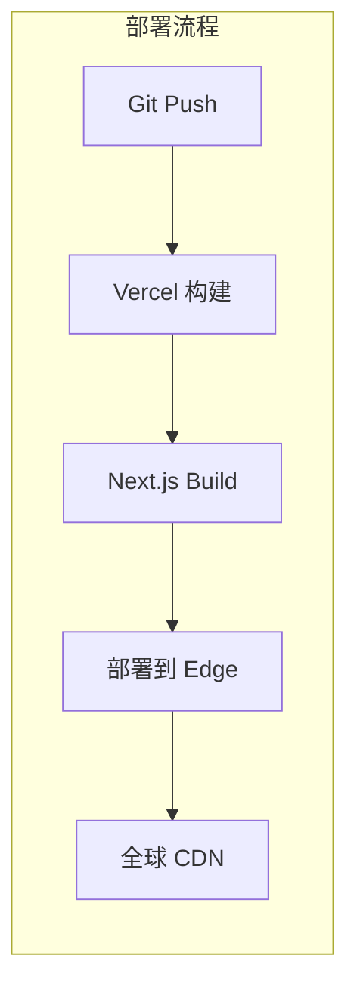

**选择理由**：
- 完整支持 API Routes，BFF 网关可正常工作
- 避免 CORS，服务端调用飞书 API
- Git push 自动部署
- 免费额度满足小团队

### 9.3 本地开发

```bash
npm install
cp .env.example .env.local
cp config/users.example.json config/users.json
npm run dev
# http://localhost:3500
```

### 9.4 构建与部署

```bash
npm run build
npm run start
# 或 Vercel: vercel --prod
```

---

## 10. 用户操作指南

### 10.1 登录

1. 打开系统首页
2. 输入用户名和密码
3. 点击「登录」

默认账号：admin/123456、manager/123456、sales/123456、viewer/123456

### 10.2 订单管理

| 操作 | 步骤 |
|------|------|
| 查看订单 | 订单管理 → 列表 → 搜索/筛选 |
| 新建订单 | 新建订单 → 填写信息 → 保存 |
| 编辑订单 | 列表中找到 → 编辑 → 修改 → 保存 |

### 10.3 离线使用

- 网络断开时显示离线状态
- 可查看已加载的缓存数据
- 重新联网后自动同步

### 10.4 常见问题

| 问题 | 处理 |
|------|------|
| 数据加载慢 | 检查网络，联系管理员优化 |
| 无法登录 | 确认账号密码，联系管理员重置 |
| Schema 未同步 | 系统管理 → 同步 → 点击同步 |

---

## 11. 开发规范摘要

### 11.1 禁止硬编码

| 禁止项 | 正确做法 |
|--------|----------|
| 飞书字段名 | 通过 Schema 动态获取 |
| 表 ID | 环境变量 `process.env.FEISHU_TABLE_*` |
| 字段类型 | 读取飞书字段元数据 |
| 组件渲染 | Schema 驱动的 DynamicField |

### 11.2 核心文件保护

| 文件 | 保护级别 |
|------|----------|
| useTableData.ts | 最高 |
| field-mapping.ts | 最高 |
| field-adapters.ts | 最高 |
| formula-parser.ts | 最高 |

### 11.3 业务展示规范

- **公式字段**：表格显示，表单只读，不提交
- **货币符号**：与「货币」字段一致，CNY→¥，USD→$
- **写操作**：高置信度校验，必要时双轮确认

### 11.4 数据同步策略

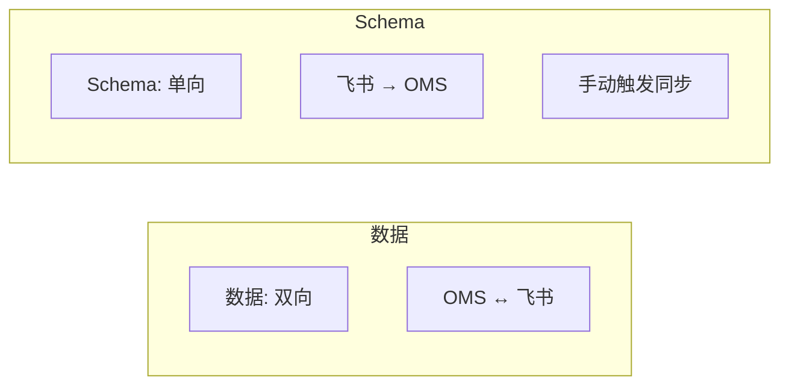

---

## 12. 附录

### 12.1 相关文档

| 文档 | 路径 | 说明 |
|------|------|------|
| 部署指南 | docs/deployment.md | 环境、部署步骤 |
| 飞书配置 | docs/feishu-setup.md | 应用创建、权限、表结构 |
| 用户手册 | docs/user-guide.md | 登录、操作、权限、FAQ |
| 开发规范 | docs/DEVELOPMENT_STANDARDS.md | 技术架构、数据层、流程 |

### 12.2 术语表

| 术语 | 说明 |
|------|------|
| OMS | Order Management System，订单管理系统 |
| BFF | Backend for Frontend，面向前端的后端网关 |
| Schema | 表结构元数据，字段定义、类型、关联 |
| SWR | Stale-While-Revalidate（package.json 有依赖，当前代码未使用） |
| dataKey | 字段映射后的驼峰命名键，如 orderAmount |
| ProcessedField | 含 raw/parsed/formatted 的字段处理结果 |

---

*文档结束*
